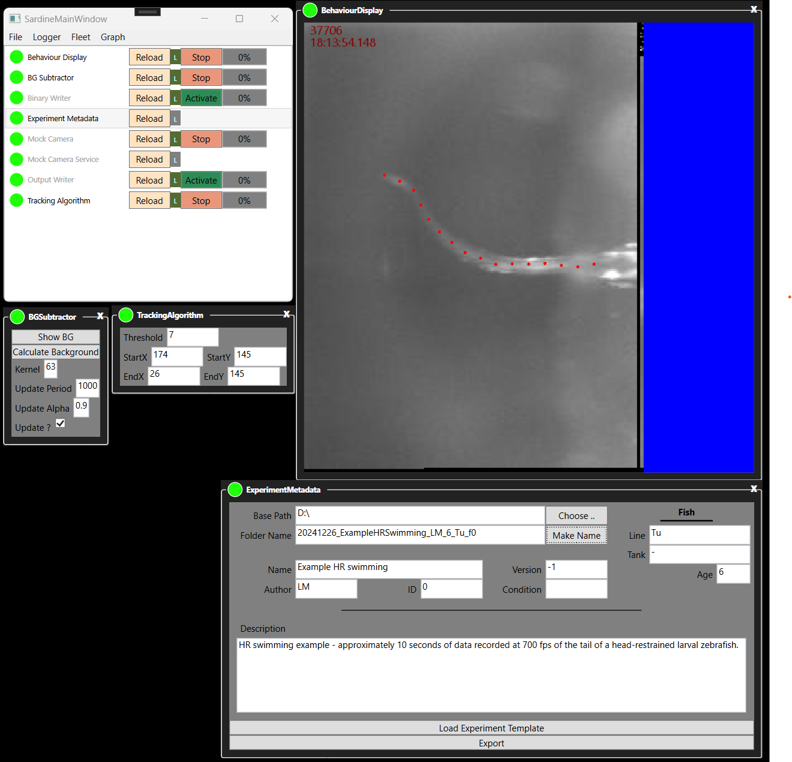

# Components
Components representing hardware or data processing functions for use with **[Sardine](https://github.com/orger-lab/sardine)**.

## Components
### Constructs
| Project Name | NuGet  | Description |
| :---------------- | :------: | :----: |
| Sardine.Constructs        |   ❌  |  |
| Sardine.ImageProcessing        |   ❌  |  |
| Sardine.Optics        |   ❌  |  |
| Sardine.Sequencer        |   ❌  |  |
| Views\Sardine.Sequencer.Views.WPF        |   ❌  |  |
### Data Processes
| Project Name | NuGet  | Description |
| :---------------- | :------: | :----: |
| Image Processing/Sardine.ImageProcessing.BGSubtraction.OpenCV        |   ❌  |  |
| Image Processing/Sardine.ImageProcessing.BGSubtraction       |   ❌  |  |
| Image Processing/Views/Sardine.ImageProcessing.BGSubtraction.Views.WPF       |   ❌  |  |
| Recorders/Sardine.Recording.Data.Text       |   ❌  |  |
| Recorders/Sardine.Recording.Metadata.Zebrafish     |   ❌  |  |
| Recorders/Sardine.Recording.Metadata        |   ❌  |  |
| Recorders/Sardine.Recording.Stream.Binary     |   ❌  |  |
| Recorders/Sardine.Recording.Metadata.Zebrafish.Views.WPF     |   ❌  |  |
| Tracking/Sardine.Tracking.ZebraHRTailTracking.DisplayExtensions      |   ❌  |  |
| Tracking/Sardine.Tracking.ZebraHRTailTracking      |   ❌  |  |
| Tracking/Sardine.Tracking.ZebraHRTailTracking.Views.WPF      |   ❌  |  |
### Devices
| Project Name | NuGet  | Description |
| :---------------- | :------: | :----: |
| Hamamatsu/Sardine.Devices.Hamamatsu.Camera        |   ❌  |  |
| Hamamatsu/Sardine.Devices.Hamamatsu.Camera.API        |   ❌  |  |
| Hamamatsu/Sardine.Devices.Hamamatsu.Camera.API.OrcaFlash.Windows        |   ❌  |  |
| Hamamatsu/Sardine.Devices.Hamamatsu.Camera.Views.WPF        |   ❌  |  |
| National Instruments/Sardine.Devices.NI.DAQ        |   ❌  |  |
| National Instruments/Sardine.Devices.NI.Views.WPF        |   ❌  |  |
| Mock Devices/Sardine.Test.AVIReader        |   ❌  |  |
| Mock Devices/Sardine.Test.BinaryStreamToImageFrameReader        |   ❌  |  |
### Utils
| Project Name | NuGet  | Description |
| :---------------- | :------: | :----: |
| Sardine.Utils.Measurements        |   ❌  |  |
| Sardine.Utils.Waveforms        |   ❌  |  |
| Sardine.Utils.Windows        |   ❌  |  |
### Visualizers
| Project Name | NuGet  | Description |
| :---------------- | :------: | :----: |
| Display/Sardine.Display.Skia       |   ❌  |  |
| Display/Sardine.Display.Skia.Views      |   ❌  |  |
| Display/Views/Sardine.Display.Skia.Views.WPF      |   ❌  |  |

## Quick Start
+ Operating System requirements: Windows 10 version 1607 or above
+ Visual Studio requirement: version 17.8 or above

### Larval zebrafish tail tracker
This example shows live tracking of a video recording of the tail of a head-restrained larval zebrafish, collected at 700 fps and played back. 
To accomplish the tracking, OpenCV (through the  is used to process the video images.

Images produced by the camera (here read from a prerecorded file) are passed to a binary recorder, to a display, and to a background subtraction operation.
The result of the background subtraction is then used to track 16 equidistant points along the fish tail by iteratively searching for the center of mass across an arc drawn around the previous tracked point.
These results are displayed on screen, and also saved to a text file.
A component that uses the metadata service is also present, and allows setting metadata fields and the save path for the output data.

1. Clone this repository (`git clone https://github.com/orger-lab/sardine-components`)
2. Obtain the openCV v2.4.13.6 runtime (download available [here](https://sourceforge.net/projects/opencvlibrary/files/opencv-win/2.4.13/opencv-2.4.13.6-vc14.exe/download))
3. Extract the downloaded files, and copy the runtime libraries (contained in `opencv\build\x64\vc14\bin`) to the folder `samples\FictiveFishTrackerExampleApp\opencv`
2. Open `Sardine-Components.sln` in Visual Studio
3. Select `FictiveFishTrackerExampleApp` as the startup project
4. Build and run

  

  
    

  

  

#### Using the test application
1. Double click the name of a vessel to open its UI. Grayed out vessels do not have UIs.
2. All vessels operating correctly will have a green indicator to the left of their name.
3. The 'Reload' button immediatly invalidates a vessel and relaunches it.
4. Pressing 'Activate' and 'Stop' will respectively activate data operations associated with that vessel or stop them. In the example, activating one of the writers will immediately cause them to start writing to disk. The percentage indicator represents queue occupation.
5. To choose a folder to record data to, open the Experiment Metadata vessel and export a recording path. You can either choose a folder name at will, or fill in some metadata fields and ask the controller to auto-generate a name. The exported recording path will be transferred to the writers.
6. Through the menus, you can access the Logger, the Graph view, and through the File menu you can save and restore layouts.

